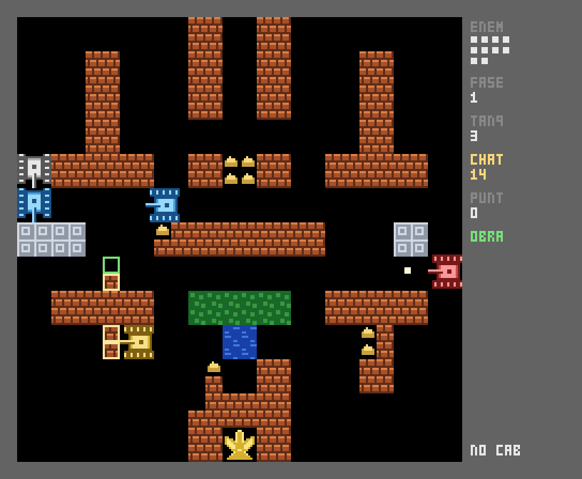

# TANK SCRAP 1990

Tank shooter de pixeles al estilo *Battle City / Tank 1990* (NES, 1985-90),
escrito en Python + pygame, con **una vuelta de tuerca**:

> ## El mapa es munición
> Cada ladrillo que se rompe en el campo —lo rompas tú o lo rompa el enemigo—
> deja **chatarra** en el suelo. La recoges pisándola y la gastas
> **construyendo muro donde tú quieras**. El escenario deja de ser decorado:
> es tu almacén de material, y cada disparo que das al paisaje es una decisión
> económica.

De eso salen dilemas que el juego original no tiene:

- Abrir una brecha para pasar te da chatarra, pero también le abre camino al
  enemigo hacia tu águila.
- Puedes **dejar que un enemigo reviente un muro** para quedarte tú la
  chatarra: cebo y beneficio.
- Los cuatro ladrillos alrededor del águila ya no son un hecho consumado: si
  te los tiran, los vuelves a levantar tú, con lo que llevas encima.
- Con 6 de chatarra levantas **acero**, que aguanta cualquier bala salvo la del
  tanque rojo (perfora). Un búnker sale caro: seis ladrillos rotos por placa.
- Si te matan, **sueltas la mitad de la chatarra** en el sitio. Morir cargado
  duele; y la que sueltas se queda ahí para quien llegue antes.
- La chatarra se oxida: **14 segundos** en el suelo y desaparece. Hay que ir a
  por ella.



## Jugar

```bash
pip install -r requirements.txt
python3 -m tank_scrap
```

## Controles

| Tecla | Acción |
| --- | --- |
| Flechas / WASD | mover |
| Espacio | disparar |
| `B` | entrar y salir del **modo obra** |
| Flechas (en obra) | mover el cursor de construcción (alcance 5 subtiles) |
| Espacio (en obra) | poner ladrillo — cuesta **1** de chatarra |
| Shift o `E` (en obra) | poner acero — cuesta **6** |
| `X` (en obra) | recuperar un muro **tuyo** y recobrar su coste |
| `P` | pausa |
| `Esc` | salir |

El tiempo **no se detiene** en modo obra: construir mientras te disparan es
parte del juego.

## Reglas

- Pierdes si te destruyen el águila o si te quedas sin tanques (3 vidas).
- Superas la fase cuando acabas con toda la oleada; hay 3 mapas y las oleadas
  se endurecen al ciclarlos.
- Tanques enemigos: gris (normal), azul (rápido), rojo (bala rápida que
  **perfora acero**), morado (blindado, 4 impactos).
- El agua bloquea, los árboles tapan la vista, el hielo te hace patinar.
- Un disparo rompe un subtile de 8 px; un tanque mide 16 px, así que hacen
  falta dos disparos para abrir un hueco por el que pasar.

## Desarrollo

```bash
pip install -r requirements-dev.txt
python3 -m pyflakes tank_scrap/*.py
python3 -m pytest tests -q
SDL_VIDEODRIVER=dummy python3 -m tank_scrap --selftest 1800   # 1800 frames sin ventana
```

Todo el pixel art se genera en código (`tank_scrap/sprites.py`): no hay
assets, ni fuentes del sistema —el HUD usa una tipografía de mapa de bits 3x5
hecha a mano en `tank_scrap/pixfont.py`.

Los mapas están en `tank_scrap/levels.py` como 13 filas de 13 caracteres
(`#` ladrillo, `@` acero, `~` agua, `x` árboles, `-` hielo, `A` águila).
Añadir una fase es añadir un bloque de texto.

## Aviso sobre el historial de este repo

`code-temple` era un repo de documentación archivado (todo migrado a
[midgaror](https://github.com/alvarofernandezmota-tech/midgaror)). Esta rama
reutiliza el repo para el juego y parte de cero: la documentación anterior
sigue en el historial de git y en `midgaror`.
